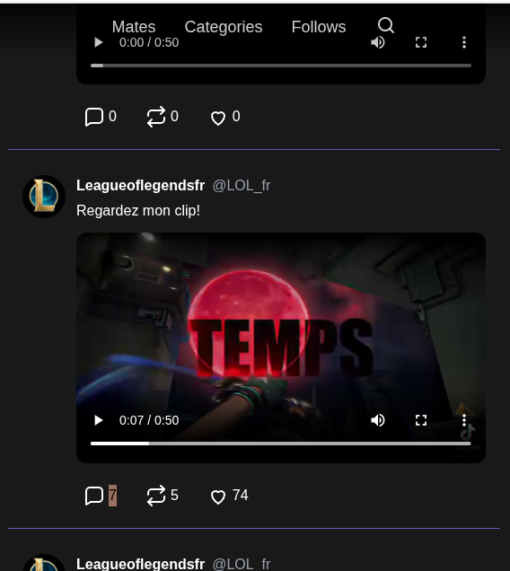
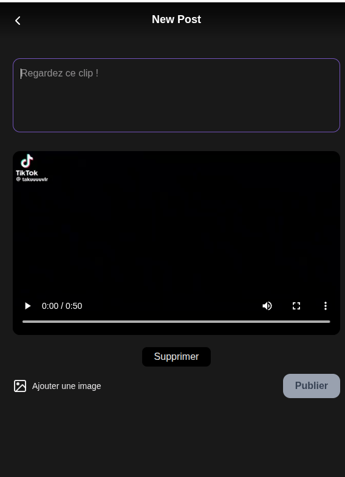
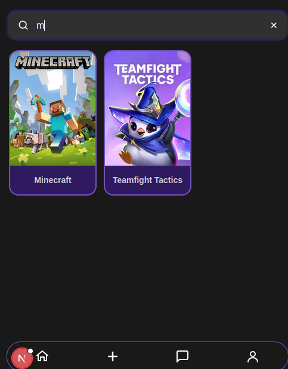
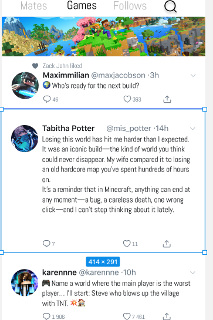
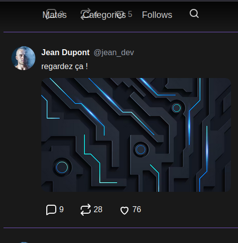
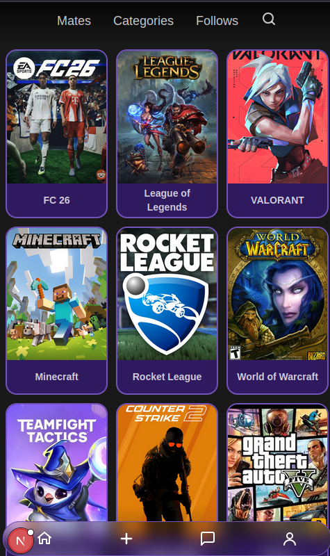
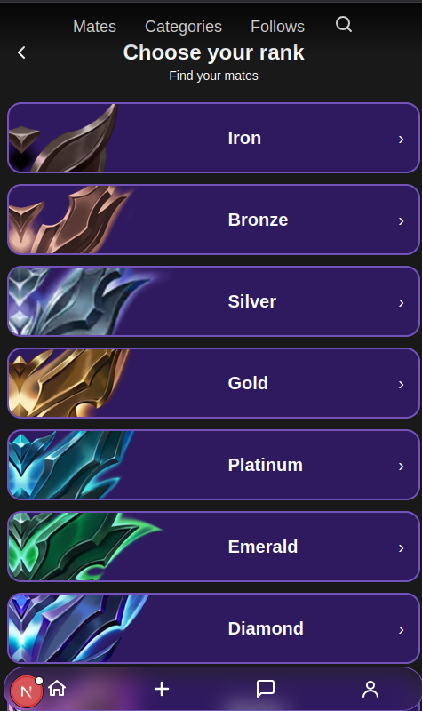
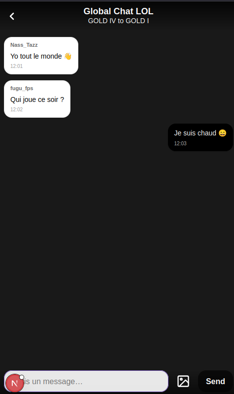

# User Journey — Next Level

## Application Objective
**Next Level** is a social network dedicated to gamers.  
Its goal is to bring players together on a single platform, allowing them to share video game–related content, follow other players, and easily find teammates.

---

## Main User Journey

### 1. Login
The user must **log in** to access the application, or sign up and choose **3 games**.

---

### 2. Home Page
After logging in, the user arrives on the **home page**, where a **personalized news feed** is displayed.

This feed contains posts including:
- gameplay clips  
- images  
- messages related to different video games (**Valorant**, **League of Legends**)

---

### 3. Profile Page
On their profile page, the user can:
- see their number of followers and following  
- edit their biography  
- change their profile picture  
- view only their own posts

---

### 4. Creating a Post
The user can create a new post from the application:
- add an image  
- upload a video clip with a maximum duration of **2 minutes**  
- write a message related to the game or shared content  
  (e.g. **Valorant highlights** or **League of Legends strategies**)

---

### 5. Viewing Personalized Posts
The user can access a page displaying only posts from players they follow.

---

### 6. Game Search
Using the search bar, the user can enter the name of a game.

They are redirected to the game’s dedicated page, where they can:
- see all posts related to the game  
- discover active players  
- interact with content (likes and comments)

**Examples:** Valorant, Minecraft.

---

### 7. Interaction with Posts
On each post, the user can:
- see the number of **likes**  
- read **comments**  
- like a post  
- write a comment

---

### 8. Teammate Search
The user can access a page dedicated to **finding teammates**:
- select the game they play  

- access a **chat room** and a **competitive room** with ranks.

Players can therefore find compatible teammates or simply interact with the community.
