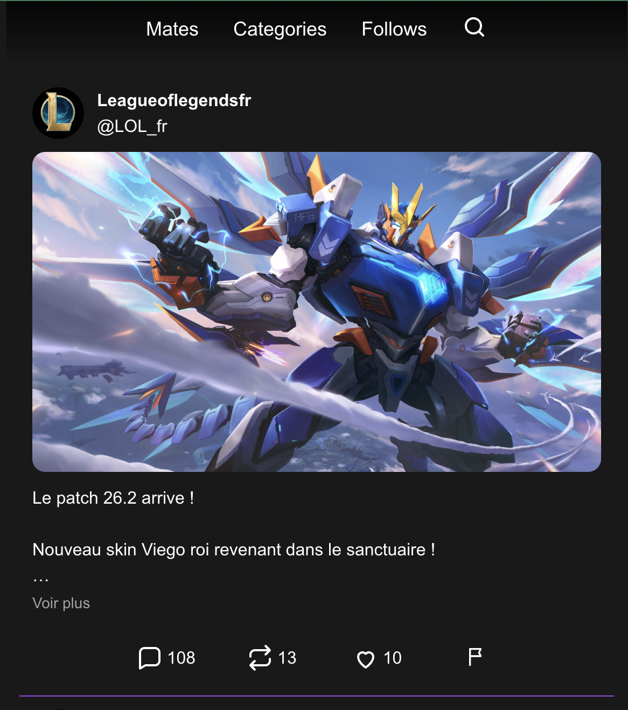
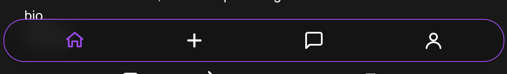
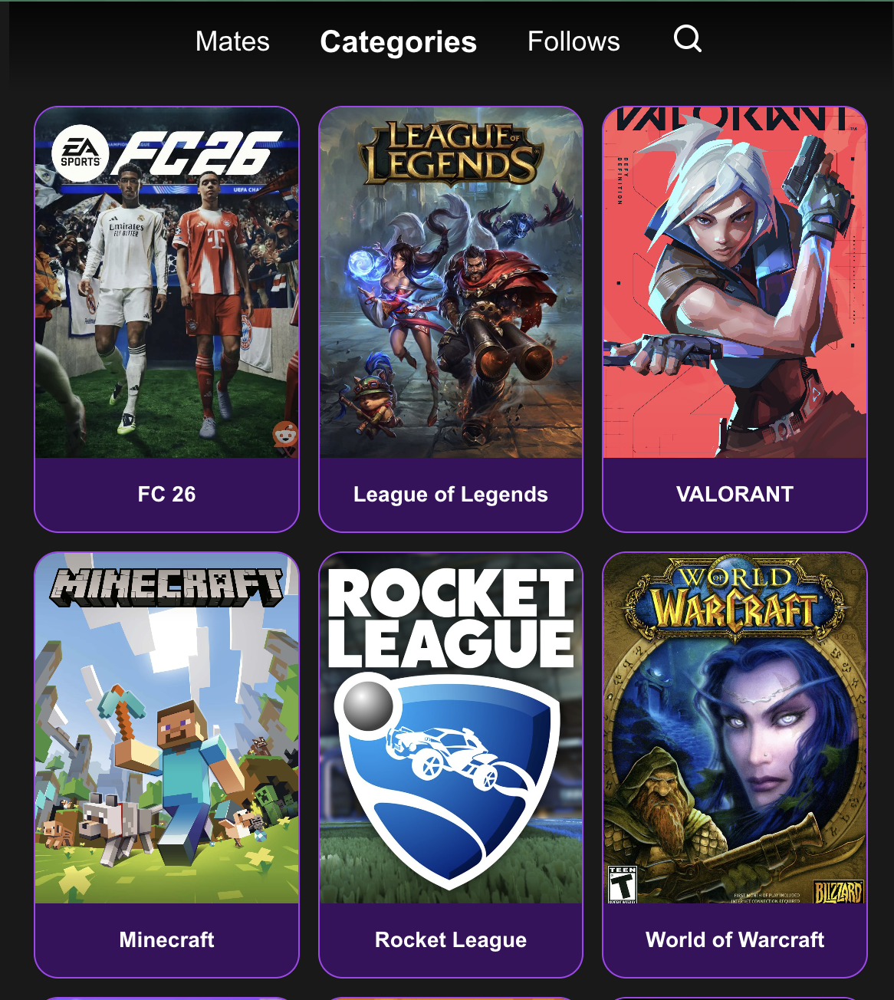
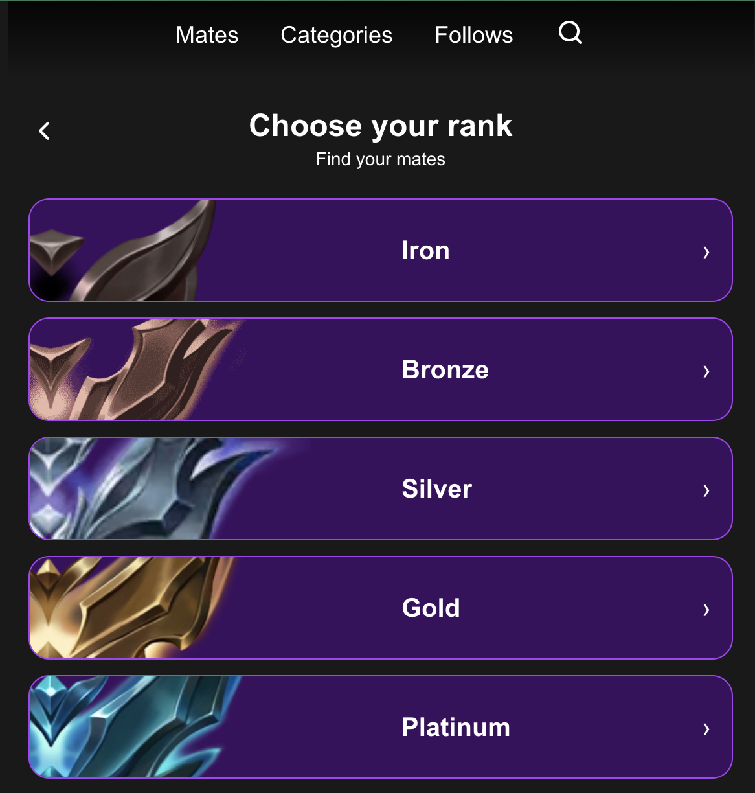

We decided to implement a **bottom bar** and a **top bar** for app navigation.

In these two bars, we chose to include **four buttons**, which is more visually pleasing.  
This choice also allows us to differentiate from older social networks that often use more traditional navigation patterns.

For the top bar we decide to use a **bg-gradient-to-b** to give the application a modern look

Regarding the **bottom bar**, we opted for a **rectangle with rounded corners** to make the interface feel warmer and to clearly show that this is where the **most important options** are located.  
We also added a **background blur effect** so that the bottom bar remains visible and readable while still showing the content behind it.

---

On the **teammates and categories** page, the interface looks like this:

On this page, you can find different games with their **image** and **title**, displayed in **rounded rectangles** to make the interface more aesthetically pleasing and engaging than simply showing an image.  
We also decided to place the **title below the image** to ensure good readability and a clear understanding of the content.

---

On the **mate search** page, designed to find players of the same level:

Here, we maintain the use of **rounded rectangles** to ensure visual consistency with the rest of the app.  
We decided to place the **game logos on the left side**, without showing them in full width, to make the interface more dynamic and attractive while highlighting the creativity of the design.

In the center, we display the **rank names**, as this is the most important information for the user and should therefore be highlighted.  
Finally, an **arrow** is placed on the right to indicate a possible action or navigation.

We chose to use **border-1** to maintain a subtle effect and make the user interface as pleasant as possible.

We selected the colors from reference "#A742EE and #3A105E" because this color combination gives the application a gamified feel. We also chose them because of the logo we created, which incorporates these colors.
