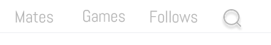
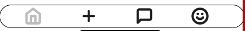
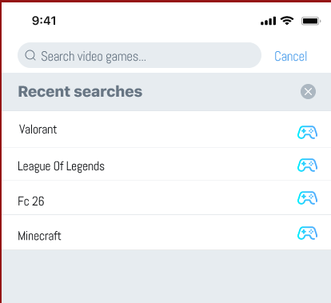
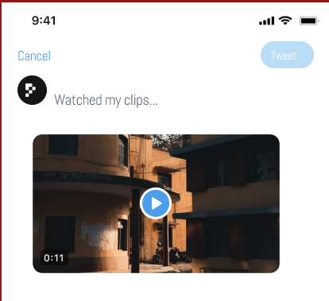
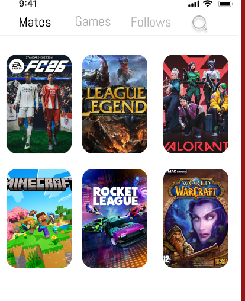
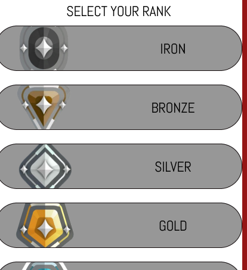

## Prototype Link

Here is the link to the Figma prototype:  
https://www.figma.com/proto/lEGPJc2VSRsEQGROEieSMj/Twitter-UI-Screens--Community-?node-id=4-1224&t=XKO8kC62tYNMBL4O-1

---

## Global Interactions

The interactions available across the entire application are limited to the following elements:

### Top Bar
The different buttons allow users to:
- Access the **Teammates** page
- Access the **Games** page
- View only followed users’ posts via the **Follow** button
- Access the **Search** page to find a game

---

### Bottom Bar
The different buttons allow users to:
- Access the **Home** page
- **Create a post**
- View **messages**
- Access the **Profile** page

---

## Interaction Details by Page

### Home Page
- Starting point of the **main flow** when launching the prototype on Figma

---

### Search Page

Available interactions:
- The **Minecraft** button, which redirects to posts related to this game
- The **Cancel** button, which returns the user to the **Home** page

---

### Post Page

Available interactions:
- The **Cancel** button, which returns the user to the **Home** page
- The **Post** button, which redirects to the **Profile** page where the post is displayed

---

### Mates Page

Available interactions:
- The **Valorant** game, which redirects to the **Ranked** page

In the **Ranks** section:
- Only the **Gold** rank is interactive and redirects to the **game chat** with players of the same rank

  

---

## Summary

- Global interactions are limited to the **Top Bar** and the **Bottom Bar**
- Each page contains specific interactive elements
- The **main flow** is centered on the **Home** page
